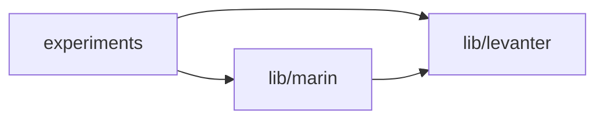

# Step 2: Levanter Integration

Merge Levanter repository with full Git history and integrate as workspace member.

**Status**: Ready to merge ([#1723])

## Usage

```bash
# From repo root, starting from ws branch (after step 1)
./workspace-migration/step2/main.sh [options]

# Options:
#   -l, --lock-ref REF        Use uv.lock from specified git ref instead of re-resolving
#                             (saves 5-10 minutes during testing)
#   -r, --levanter-repo PATH  Path to Levanter repo (default: ../levanter)

# Examples:
./workspace-migration/step2/main.sh                           # Default
./workspace-migration/step2/main.sh --lock-ref ws-2          # Skip uv sync
./workspace-migration/step2/main.sh -r ~/levanter            # Custom path
```

## What It Does

**Prerequisites**: Step 1 must be complete

### Part 1: Prepare Levanter Branch

1. Extract Levanter and dolma SHAs from `lib/marin/pyproject.toml`
2. Create `levanter-pkg` branch from extracted Levanter SHA
3. Move all Levanter files to `lib/levanter/`
4. Preserve full Git history

### Part 2: Merge into Workspace

1. Merge `levanter-pkg` into current branch (with `--allow-unrelated-histories`)
2. Resolve conflicts:
   - `pyproject.toml`: Keep workspace root version
   - `.github/`: Take Levanter workflows (will be renamed in Part 3)
3. Update workspace configuration:
   - Add `lib/levanter` to workspace members
   - Add `levanter` to root dependencies (experiments imports levanter directly)
   - Change marin's levanter dependency from git URL to workspace reference
   - Add dolma git source with specified SHA
4. Update `uv.lock` (or use `--lock-ref` to skip)

### Part 3: Migrate Workflows and Configs

1. **Rename workflows**:
   - Marin: `*.yaml` → `marin-*.yaml`
   - Levanter: `lib/levanter/.github/workflows/*.yaml` → `.github/workflows/levanter-*.yaml`

2. **Update workflow content** (using [yaya] for YAML transformations):
   - Add "Marin - " / "Levanter - " prefixes to workflow names
   - Add path filters to trigger only on relevant changes
   - For Levanter workflows:
     - Set `working-directory: lib/levanter`
     - Add `--package levanter --frozen` to uv commands
     - Update TPU SSH commands for monorepo paths

3. **Update TPU setup scripts**:
   - Clone marin monorepo instead of levanter repo
   - Use marin directory name
   - Add `--package levanter --frozen` to uv sync

4. **Update pre-commit config**:
   - Exclude `lib/levanter/` from Marin license insertion hook

5. **Update ReadTheDocs configs**:
   - Add `--frozen` flag to `uv sync` and `uv run` commands
   - Prevents git dependency updates during RTD builds

6. **Update ray_deps.py**:
   - Add `lib/levanter/src` to PYTHONPATH
   - Changes from `["lib/marin/src", "experiments"]` to `["lib/marin/src", "lib/levanter/src", "experiments"]`

7. **Move dependabot.yml**:
   - `lib/levanter/.github/dependabot.yml` → `.github/dependabot.yml`
   - Workspace uses single shared `uv.lock`

## Files

### [`main.sh`]
Main step 2 migration script. Hermetic bash script that orchestrates all 3 parts.

### [`update_workflows.py`]
Updates GitHub Actions workflows using [yaya]:
- Uses `insert_key_between()` API for safe, verified insertions
- Handles all GitHub Actions job structures
- Zero conflicts on all Levanter workflows (was 9 before yaya improvements)

### [`update_tpu_setup.py`]
Updates TPU setup scripts (`lib/levanter/infra/helpers/setup-tpu-vm*.sh`):
- Change repo URL to marin monorepo
- Add `--package levanter --frozen` to uv commands
- Create `venv_path.txt` for monorepo venv location

### [`update_workspace_toml.py`]
Updates workspace `pyproject.toml` using [tomlkit]:
- Add `lib/levanter` to workspace members
- Add `levanter` to root dependencies
- Add levanter to workspace sources
- Update marin's levanter dependency to workspace reference
- Add dolma git source with specified SHA

### [`update_ray_deps.py`]
Adds `lib/levanter/src` to PYTHONPATH in `ray_deps.py`:
- Builds on step 1's change (expects `lib/marin/src` already present)
- Fixes imports for Ray jobs that use levanter

### [`update_precommit.py`]
Updates `.pre-commit-config.yaml`:
- Excludes `lib/levanter/` from Marin's license insertion hook
- Preserves Levanter's existing license headers

### [`update_readthedocs.py`]
Updates `.readthedocs.yaml` and `lib/levanter/.readthedocs.yaml`:
- Adds `--frozen` flag to `uv sync` and `uv run` commands
- Prevents dependency updates during documentation builds

### [`sync.sh`]
Sync Levanter updates from upstream (for keeping `lib/levanter` in sync).

### [`test.sh`]
Test harness for verifying step 2 reproducibility.

## Testing

```bash
# Test reproducibility
./workspace-migration/step2/test.sh

# Test with lock file reuse (faster)
./workspace-migration/step2/main.sh --lock-ref ws-2

# Manual verification
uv sync                                           # Should complete
uv run --package marin pytest tests/             # Marin tests
uv run --package levanter pytest lib/levanter/tests/  # Levanter tests
```

## Result

After step 2:

```
marin/
  pyproject.toml        # Workspace root + experiments package
  uv.lock               # Unified lockfile for all workspace members
  experiments/
  .github/workflows/
    marin-*.yaml        # Marin workflows
    levanter-*.yaml     # Levanter workflows
  lib/
    marin/              # Workspace member
      pyproject.toml
      src/marin/
    levanter/           # Workspace member (NEW)
      pyproject.toml
      src/levanter/
      infra/
```

**Git history**: Full Levanter commit history is preserved in the merged branch.

**Dependency graph**:


## Technical Notes

### YAML Transformations

Uses [yaya] (lossless-yaml) for workflow updates:
- `insert_key_between()` API ensures safe, verified insertions
- Handles GitHub Actions structures: `strategy`, `env`, `permissions`, `needs`, etc.
- **Result**: 0 conflicts (was 9 conflicts before improvements)

### TOML Transformations

Uses [tomlkit] for pyproject.toml updates:
- Preserves formatting and comments
- Handles workspace configuration sections

### Reproducibility

Step 2 is designed to be:
- **Hermetic**: No external state dependencies (besides specified Levanter repo)
- **Idempotent**: Can be run multiple times safely
- **Testable**: Includes test harness for verification

The `--lock-ref` option allows skipping expensive `uv sync` during testing while still verifying all other transformations.

[#1723]: https://github.com/marin-community/marin/pull/1723
[yaya]: https://github.com/Open-Athena/yaya
[tomlkit]: https://github.com/sdispater/tomlkit
[`main.sh`]: https://github.com/Open-Athena/marin/blob/rw%2Fws-2/workspace-migration/step2/main.sh
[`migrate_workflows_standalone.sh`]: https://github.com/Open-Athena/marin/blob/rw%2Fws-2/workspace-migration/step2/migrate_workflows_standalone.sh
[`update_workflows.py`]: https://github.com/Open-Athena/marin/blob/rw%2Fws-2/workspace-migration/step2/update_workflows.py
[`update_tpu_setup.py`]: https://github.com/Open-Athena/marin/blob/rw%2Fws-2/workspace-migration/step2/update_tpu_setup.py
[`update_workspace_toml.py`]: https://github.com/Open-Athena/marin/blob/rw%2Fws-2/workspace-migration/step2/update_workspace_toml.py
[`update_ray_deps.py`]: https://github.com/Open-Athena/marin/blob/rw%2Fws-2/workspace-migration/step2/update_ray_deps.py
[`update_precommit.py`]: https://github.com/Open-Athena/marin/blob/rw%2Fws-2/workspace-migration/step2/update_precommit.py
[`update_readthedocs.py`]: https://github.com/Open-Athena/marin/blob/rw%2Fws-2/workspace-migration/step2/update_readthedocs.py
[`sync.sh`]: https://github.com/Open-Athena/marin/blob/rw%2Fws-2/workspace-migration/step2/sync.sh
[`test.sh`]: https://github.com/Open-Athena/marin/blob/rw%2Fws-2/workspace-migration/step2/test.sh
